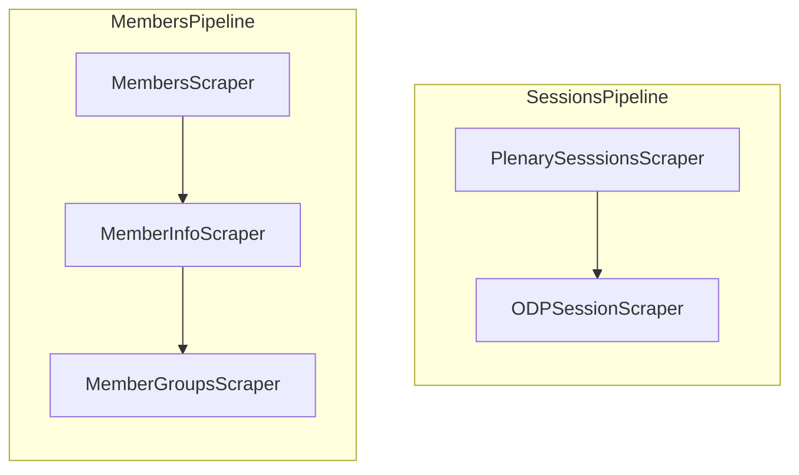
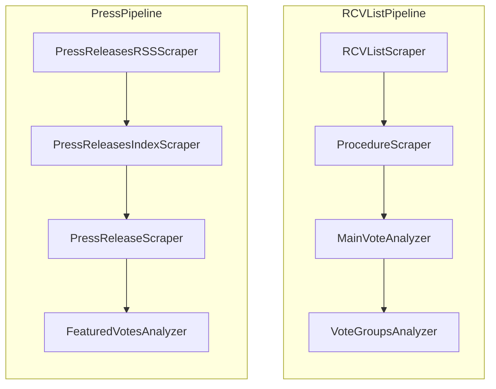

# Data Pipelines

## Once a week

```mermaid
flowchart TB

subgraph "SessionsPipeline"
    direction TB
    PlenarySesssionsScraper --> ODPSessionScraper
end

subgraph "MembersPipeline"
    direction TB
    MembersScraper --> MemberInfoScraper
    MemberInfoScraper --> MemberGroupsScraper
end
```

## Every day during a session

```mermaid
flowchart TB
subgraph "RCVListPipeline"
    direction TB
    RCVListScraper --> ProcedureScraper
    ProcedureScraper --> MainVoteAnalyzer
    MainVoteAnalyzer --> VoteGroupsAnalyzer
end

subgraph "PressPipeline"
    direction TB
    PressReleasesRSSScraper --> PressReleasesIndexScraper
    PressReleasesIndexScraper --> PressReleaseScraper
    PressReleaseScraper --> FeaturedVotesAnalyzer
end
```
